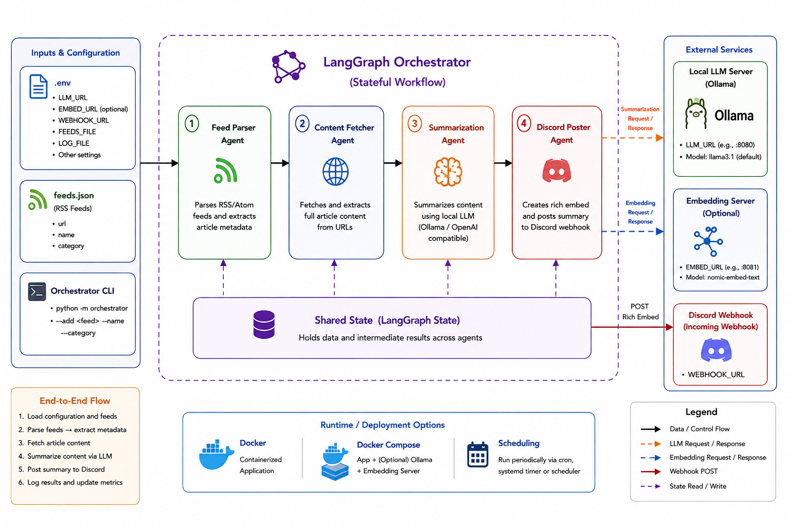

````markdown
# AI News Multi-Agent System 📰

A multi-agent system built with **LangGraph** and **LangChain** that automatically parses RSS feeds, fetches article content, summarizes it using a local LLM, and posts the summary to Discord.

---

## 🏗️ Architecture


---

## 🚀 Features

- **Multi-Agent Architecture**: Four specialized agents working in a pipeline
  - **Feed Parser Agent**: Parses RSS/Atom feeds and extracts article metadata
  - **Content Fetcher Agent**: Fetches and extracts article content from URLs
  - **Summarization Agent**: Summarizes content using a local LLM (Ollama)
  - **Discord Poster Agent**: Posts summaries to Discord webhook

- **Local LLM Integration**: Uses Ollama or any OpenAI-compatible API for summarization
- **LangGraph Pipeline**: Built with LangGraph for reliable, stateful agent workflows
- **Docker Support**: Full containerization with docker-compose
- **Categorized Feeds**: Organize feeds by category (Technology, Sports, etc.)
- **Rich Discord Embeds**: Displays title, link, category, and thumbnail
- **Logging & Statistics**: Track processing metrics in logs

---

## 📋 Requirements

- Python 3.8+
- Ollama (or any OpenAI-compatible LLM API)
- Docker (optional, for containerized deployment)

---

## 🔧 Setup

### 1. Clone the Repository

```bash
git clone <repository-url>
cd AI News Agent
````

### 2. Install Dependencies

```bash
pip install -r requirements.txt
```

### 3. Configure Environment Variables

```bash
cp .env.example .env
```

Edit `.env` and configure:

```env
# Local LLM server (Ollama default)
LLM_URL=http://localhost:8080/v1

# Embedding model server (optional)
EMBED_URL=http://localhost:8081/v1/embeddings

# Discord webhook URL (optional, leave empty to disable)
WEBHOOK_URL=

# Feeds configuration
FEEDS_FILE=feeds.json

# Logging
LOG_FILE=news.log
```

### 4. Configure Feeds

Edit `feeds.json` to add your RSS feeds:

```json
{
  "feeds": [
    {
      "url": "https://techcrunch.com/feed/",
      "name": "TechCrunch",
      "category": "Technology"
    },
    {
      "url": "https://arstechnica.com/feed/",
      "name": "Ars Technica",
      "category": "Technology"
    },
    {
      "url": "https://espn.com/espn/rss/news",
      "name": "ESPN News",
      "category": "Sports"
    }
  ]
}
```

---

## 📁 Project Structure

```javascript
AI News Agent/
├── .env.example          # Environment variable template
├── .env                  # Your configuration
├── feeds.json            # RSS feed URLs
├── feeds.py              # Original feed parsing (legacy)
├── agents.py             # Multi-agent system with LangGraph
├── orchestrator.py       # Main orchestration logic
├── llm_utils.py          # LLM client utilities
├── Dockerfile            # Docker container definition
├── docker-compose.yml    # Docker Compose configuration
├── requirements.txt      # Python dependencies
└── README.md             # This file
```

---

## 🛠️ How It Works

1. __Load Configuration__: Reads `.env` for settings and `feeds.json` for RSS feeds
2. __Parse Feeds__: Each Feed Parser Agent extracts metadata (title, link, image, date)
3. __Fetch Content__: Content Fetcher Agent retrieves full article HTML
4. __Summarize__: Summarization Agent sends content to local LLM for summarization
5. __Post to Discord__: Discord Poster Agent creates rich embed and posts to webhook

---

## 📝 Configuration Files

### `.env.example`

```env
# LLM Configuration
LLM_URL=http://localhost:8080/v1
EMBED_URL=http://localhost:8081/v1/embeddings

# Discord Webhook
WEBHOOK_URL=

# Feeds
FEEDS_FILE=feeds.json

# Logging
LOG_FILE=news.log
```

---

## 🚀 Usage

### Run the Orchestrator

```bash
python -m orchestrator
```

### Add a Feed on the Fly

```bash
python -m orchestrator --add "https://example.com/feed/" --name "Example" --category "General"
```

### Run with Docker

```bash
docker-compose up --build
```

### Run with Docker Compose (with Ollama)

```bash
# Uncomment Ollama services in docker-compose.yml
docker-compose up --build
```

---

## 📦 Dependencies

```javascript
langgraph       # Multi-agent workflow orchestration
langchain       # LLM integration utilities
langchain-ollama # Ollama LLM client
feedparser      # RSS/Atom feed parsing
requests        # HTTP client
python-dotenv   # Environment variable management
```

---

## 🔧 Advanced Configuration

### Custom LLM Model

```env
LLM_MODEL=llama3.1  # Change default model
MAX_TOKENS=1000      # Increase response limit
```

### Batch Processing

```env
BATCH_SIZE=10  # Process multiple feeds in one run
```

### Ollama with Embedded Models

Run Ollama with embedding model:

```bash
ollama pull nomic-embed-text
ollama serve
```

Then update `.env`:

```env
EMBED_URL=http://localhost:8081/v1/embeddings
EMBED_MODEL=nomic-embed-text
```

---

## 📊 Output Example

```javascript
=== Processing feeds ===
Loaded 3 feeds from feeds.json

=== Technology ===
  • TechCrunch: New AI Startup Raises $50M
    Link:  https://techcrunch.com/ai-startup
    Image: https://techcrunch.com/wp-content/uploads/ai.jpg
  • Ars Technica: Quantum Computing Breakthrough
    Link:  https://arstechnica.com/quantum
    Image: None

=== Sports ===
  • ESPN: Championship Finals Recap
    Link:  https://espn.com/championship
    Image: None

✓ Sent to Discord: New AI Startup Raises $50M
✓ Sent to Discord: Quantum Computing Breakthrough
✓ Sent to Discord: Championship Finals Recap

Statistics:
  Processed: 3/3 feeds
  Errors: 0
```

---

## 🐳 Docker Usage

### Build and Run

```bash
docker-compose up --build
```

### With Ollama

```bash
# Start Ollama separately
ollama serve

# Then run with docker-compose (uncomment Ollama services)
docker-compose up --build
```

---

## 📝 License

MIT License - see LICENSE file for details.

---

## 🤝 Contributing

# Contributions are welcome! Please feel free to submit a Pull Request.

# AI News Multi-Agent System 📰

A multi-agent system built with __LangGraph__ and __LangChain__ that automatically parses RSS feeds, fetches article content, summarizes it using a local LLM, and posts the summary to Discord.

---

## 🏗️ Architecture


---

## 🚀 Features

- __Multi-Agent Architecture__: Four specialized agents working in a pipeline

  - __Feed Parser Agent__: Parses RSS/Atom feeds and extracts article metadata
  - __Content Fetcher Agent__: Fetches and extracts article content from URLs
  - __Summarization Agent__: Summarizes content using a local LLM (Ollama)
  - __Discord Poster Agent__: Posts summaries to Discord webhook

- __Local LLM Integration__: Uses Ollama or any OpenAI-compatible API for summarization

- __LangGraph Pipeline__: Built with LangGraph for reliable, stateful agent workflows

- __Docker Support__: Full containerization with docker-compose

- __Categorized Feeds__: Organize feeds by category (Technology, Sports, etc.)

- __Rich Discord Embeds__: Displays title, link, category, and thumbnail

- __Logging & Statistics__: Track processing metrics in logs

---

## 📋 Requirements

- Python 3.8+
- Ollama (or any OpenAI-compatible LLM API)
- Docker (optional, for containerized deployment)

---

## 🔧 Setup

### 1. Clone the Repository

```bash
git clone <repository-url>
cd AI News Agent
```

### 2. Install Dependencies

```bash
pip install -r requirements.txt
```

### 3. Configure Environment Variables

```bash
cp .env.example .env
```

Edit `.env` and configure:

```env
# Local LLM server (Ollama default)
LLM_URL=http://localhost:8080/v1

# Embedding model server (optional)
EMBED_URL=http://localhost:8081/v1/embeddings

# Discord webhook URL (optional, leave empty to disable)
WEBHOOK_URL=

# Feeds configuration
FEEDS_FILE=feeds.json

# Logging
LOG_FILE=news.log
```

### 4. Configure Feeds

Edit `feeds.json` to add your RSS feeds:

```json
{
  "feeds": [
    {
      "url": "https://techcrunch.com/feed/",
      "name": "TechCrunch",
      "category": "Technology"
    },
    {
      "url": "https://arstechnica.com/feed/",
      "name": "Ars Technica",
      "category": "Technology"
    },
    {
      "url": "https://espn.com/espn/rss/news",
      "name": "ESPN News",
      "category": "Sports"
    }
  ]
}
```

---

## 📁 Project Structure

```javascript
AI News Agent/
├── .env.example              # Environment variable template
├── .env                      # Your configuration
├── __init__.py               # Package initialization
├── agents.py                 # Multi-agent system with LangGraph
├── feedparse.py              # Feed parsing utilities
├── feeds.json                # RSS feed URLs
├── llm_utils.py              # LLM client utilities
├── orchestrator.py           # Main orchestration logic
├── news.log                  # Application log file
├── ai-news-agent.png         # Architecture diagram
├── Dockerfile                # Docker container definition
├── docker-compose.yml        # Docker Compose configuration
├── docker-compose.main.yml   # Main Docker Compose (extended config)
├── mcp_server/               # MCP server implementation
│   ├── __init__.py
│   └── ...                  # MCP server files
├── pipeline/                 # Processing pipeline components
│   ├── __init__.py
│   └── ...                  # Pipeline modules
├── prompts/                  # LLM prompts and templates
│   ├── __init__.py
│   └── ...                  # Prompt templates
├── requirements.txt          # Python dependencies
└── README.md                # This file
```

---

## 🛠️ How It Works

1. __Load Configuration__: Reads `.env` for settings and `feeds.json` for RSS feeds
2. __Parse Feeds__: Each Feed Parser Agent extracts metadata (title, link, image, date)
3. __Fetch Content__: Content Fetcher Agent retrieves full article HTML
4. __Summarize__: Summarization Agent sends content to local LLM for summarization
5. __Post to Discord__: Discord Poster Agent creates rich embed and posts to webhook

---

## 📝 Configuration Files

### `.env.example`

```env
# LLM Configuration
LLM_URL=http://localhost:8080/v1
EMBED_URL=http://localhost:8081/v1/embeddings

# Discord Webhook
WEBHOOK_URL=

# Feeds
FEEDS_FILE=feeds.json

# Logging
LOG_FILE=news.log
```

---

## 🚀 Usage

### Run the Orchestrator

```bash
python -m orchestrator
```

### Add a Feed on the Fly

```bash
python -m orchestrator --add "https://example.com/feed/" --name "Example" --category "General"
```

### Run with Docker

```bash
docker-compose up --build
```

### Run with Docker Compose (with Ollama)

```bash
# Uncomment Ollama services in docker-compose.yml
docker-compose up --build
```

---

## 📦 Python Dependencies

The project uses `requirements.txt` to manage Python dependencies. The main packages are:

```javascript
langgraph==1.2.10         # Multi-agent workflow orchestration
langchain==1.3.14         # LLM integration utilities
langchain-core==1.6.0     # Core LangChain functionality
langchain-mcp-adapters==0.3.2  # MCP protocol adapters
langchain-openai==1.6.0   # OpenAI integration
langchain-protocol==0.0.18    # Protocol handling
feedparser==6.0.14        # RSS/Atom feed parsing
requests==2.34.2          # HTTP client
python-dotenv==1.2.2      # Environment variable management
trafilatura==2.2.0        # Article content extraction
```

---

## 🔧 Advanced Configuration

### Custom LLM Model

```env
LLM_MODEL=llama3.1  # Change default model
MAX_TOKENS=1000      # Increase response limit
```

### Batch Processing

```env
BATCH_SIZE=10  # Process multiple feeds in one run
```

### Ollama with Embedded Models

Run Ollama with embedding model:

```bash
ollama pull nomic-embed-text
ollama serve
```

Then update `.env`:

```env
EMBED_URL=http://localhost:8081/v1/embeddings
EMBED_MODEL=nomic-embed-text
```

---

## 📊 Output Example

```javascript
=== Processing feeds ===
Loaded 3 feeds from feeds.json

=== Technology ===
  • TechCrunch: New AI Startup Raises $50M
    Link:  https://techcrunch.com/ai-startup
    Image: https://techcrunch.com/wp-content/uploads/ai.jpg
  • Ars Technica: Quantum Computing Breakthrough
    Link:  https://arstechnica.com/quantum
    Image: None

=== Sports ===
  • ESPN: Championship Finals Recap
    Link:  https://espn.com/championship
    Image: None

✓ Sent to Discord: New AI Startup Raises $50M
✓ Sent to Discord: Quantum Computing Breakthrough
✓ Sent to Discord: Championship Finals Recap

Statistics:
  Processed: 3/3 feeds
  Errors: 0
```

---

## 🐳 Docker Usage

### Build and Run

```bash
docker-compose up --build
```

### With Ollama

```bash
# Start Ollama separately
ollama serve

# Then run with docker-compose (uncomment Ollama services)
docker-compose up --build
```
