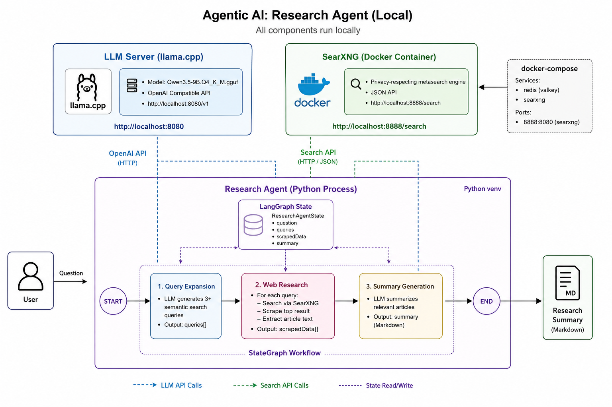

# Research Agent 🧠

This project implements a multi-stage research agent built using LangGraph. The agent automates the process of answering complex questions by systematically expanding the query, gathering information from the web via multiple search queries, and synthesizing the gathered data into a final, coherent summary.

## 📋 Table of Contents

- [Features](#-features)
- [Architecture](#-architecture)
- [Quick Start](#-quick-start)
- [Docker Deployment](#-docker-deployment)
- [Configuration](#-configuration)

---

## 🚀 Features

- **Multi-Query Research**: Automatically generates multiple semantically diverse search queries to explore different angles of a topic
- **Web Scraping**: Extracts content from multiple sources using SearXNG as a privacy-focused search engine
- **Intelligent Summarization**: Combines findings from multiple sources into a coherent, well-structured summary
- **Rich Console Output**: Beautiful terminal output with colored panels and progress indicators
- **Docker-Ready**: Fully containerized deployment with all dependencies included
- **Privacy-First**: Uses SearXNG for anonymous, uncensored search results

---

## 🏗️ Architecture



### Components

| Component | Purpose |
|-----------|---------|
| **research_agent.py** | Main application logic with LangGraph workflow |
| **Dockerfile** | Container image definition |
| **docker-compose.yml** | Multi-service orchestration |
| **searxng/** | Privacy-focused search engine container |

---

## 📦 Quick Start

### Prerequisites

- Docker and Docker Compose
- Python 3.11+ (for local development)

### Run with Docker (Recommended)

```bash
# Start all services
docker-compose up -d

# Access SearXNG search interface
# Open http://localhost:8888 in your browser

# Run the research agent
docker-compose exec research-agent python research_agent.py --topic "Your research topic here"
```

### Expected Output

```
╭─────────────────────────────────────────────────────────────────────────────────────────────────────────────────╮
│                                                                                                         │
│  ╭─────────────────────────────────────────────────────────────────────────────────────────────────────────╮ │
│  │  🚀 RESEARCH AGENT INITIALIZED                                                                                   │
│  │                                                                                                                 │
│  ╰─────────────────────────────────────────────────────────────────────────────────────────────────────────╯ │
│  ════════════════════════════════════════════════════════════════════════════════════════════════════════════ │
│                                                                                                         │
│  Model:   Qwen3.5-9B.Q4_K_M.gguf
│  Base URL: http://localhost:8080/v1
│  Timestamp: 2026-07-07 00:15:30
│                                                                                                         │
│                                                                                                         │
│  📝 Research Topic: Latest developments in quantum computing
│  
│  Starting research process...
│  
│  ╭─────────────────────────────────────────────────────────────────────────────────────────────────────────╮
│  │                                                                                                         │
│  │  📌 STAGE: Query Expansion                                                                                      │
│  │                                                                                                                 │
│  │  Original topic: Latest developments in quantum computing
│  │  Current date: July 07, 2026
│  │                                                                                                                 │
│  │  🔍 Generated search queries:
│  │     [1] breakthrough quantum computing advances 2025 2026
│  │     [2] quantum computing applications in medicine
│  │     [3] quantum computing vs classical computing comparison
│  │                                                                                                                 │
│  ╰─────────────────────────────────────────────────────────────────────────────────────────────────────────╯ │
│                                                                                                         │
│  ╭─────────────────────────────────────────────────────────────────────────────────────────────────────────╮
│  │                                                                                                         │
│  │  🔬 STAGE: Web Research                                                                                         │
│  │                                                                                                                 │
│  │  Query 1/3: breakthrough quantum computing advances 2025 2026
│  │  📄 Fetching: https://example.com/quantum-breakthroughs
│  │  📄 Fetching: https://example.com/quantum-latest
│  │                                                                                                                 │
│  ╰─────────────────────────────────────────────────────────────────────────────────────────────────────────╯ │
│                                                                                                         │
│  ╭─────────────────────────────────────────────────────────────────────────────────────────────────────────╮
│  │                                                                                                         │
│  │  📝 STAGE: Summary Generation                                                                                   │
│  │                                                                                                                 │
│  │  Topic: Latest developments in quantum computing
│  │                                                                                                                 │
│  ╰─────────────────────────────────────────────────────────────────────────────────────────────────────────╯ │
│                                                                                                         │
│  ╭─────────────────────────────────────────────────────────────────────────────────────────────────────────╮
│  │                                                                                                         │
│  │  ✅ RESEARCH COMPLETE                                                                                           │
│  │                                                                                                                 │
│  │  Final Summary:
│  │  
│  │  ## Quantum Computing: Latest Developments (July 2026)
│  │  
│  │  ### Major Breakthroughs
│  │  - [Detailed quantum computing summary would appear here]
│  │  - [Key research findings]
│  │  - [Industry applications]
│  │  
│  │  ### Key Applications
│  │  - Drug discovery and molecular simulation
│  │  - Cryptography and cybersecurity
│  │  - Financial modeling and optimization
│  │  
│  │  ### Future Outlook
│  │  - Expected timeline for commercial quantum computers
│  │  - Emerging research directions
│  │  
│  ╰─────────────────────────────────────────────────────────────────────────────────────────────────────────╯ │
│                                                                                                         │
```

---

### Service Architecture

| Service | Image | Port | Purpose |
|---------|-------|------|---------|
| research-agent | Built from Dockerfile | N/A | Main research application |
| searxng | searxng/searxng:latest | 8888:8080 | Privacy-focused search engine |
| redis | valkey/valkey:8-alpine | N/A | Session/cache storage |

### Environment Variables

```yaml
# research-agent service
SEARXNG_URL=http://searxng:8080/search
DEFAULT_LLM_URL=http://localhost:8080/v1

```